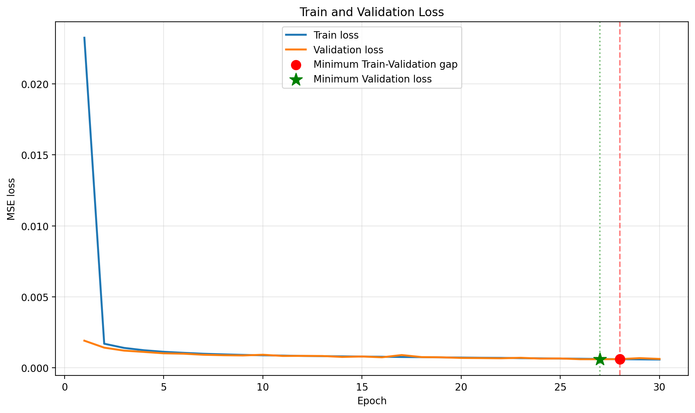
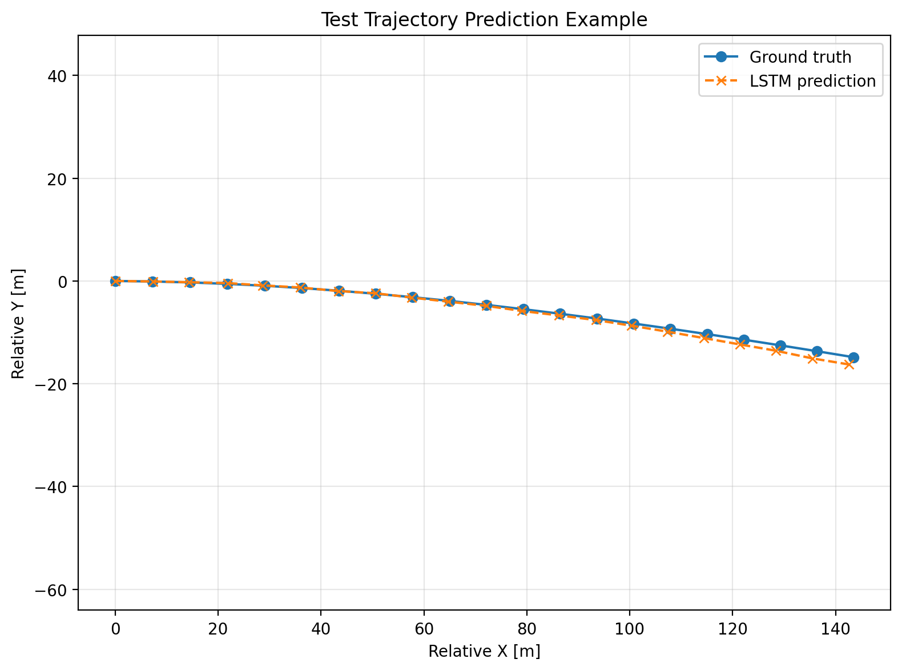
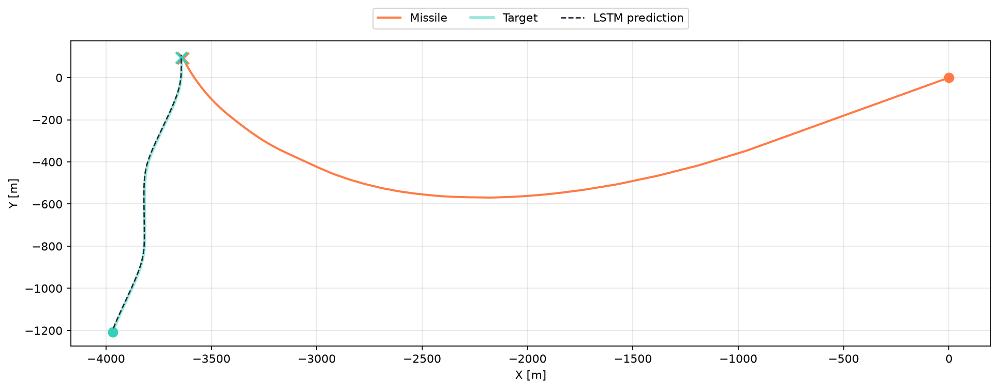
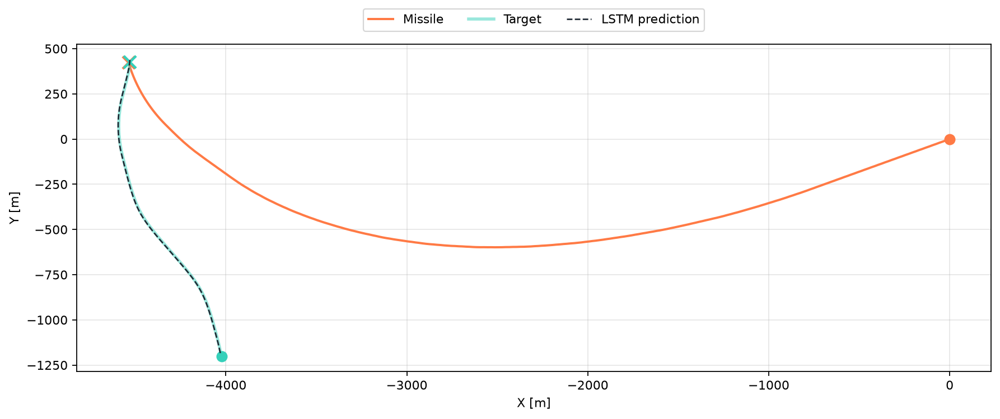
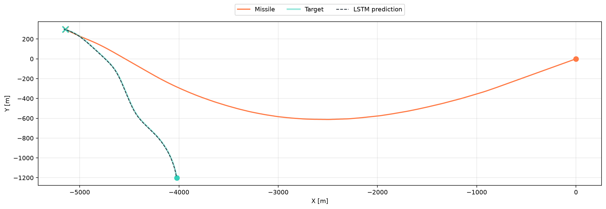
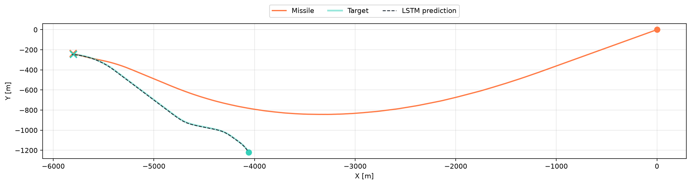

# LSTM-MPC 표적 요격 시뮬레이터

표적 항공기의 과거 2초 궤적을 LSTM에 입력하여 미래 위치를 예측하고, 예측된 표적 위치를 기준 궤적으로 사용하는 MPC를 통해 요격체의 횡가속도를 결정하는 2차원 시뮬레이터이다.

## 1. 표적 항공기 운동

### 1.1 상태 정의

표적 항공기의 상태는 다음과 같이 정의하였다.

$$
\mathbf{x}_{\mathrm{vehicle},k} =
\begin{bmatrix}
p_{x,k} \\
p_{y,k} \\
v_k \\
\psi_k \\
\phi_k
\end{bmatrix}
$$

표적은 외부에서 뱅크각 명령 $\phi_{\mathrm{cmd}}$를 받는다. 표적은 뱅크각 명령에따라 각각 다른 움직임을 만들어 낸다.

### 1.2 방향각과 위치 갱신

뱅크각이 변하면 표적의 횡가속도가 변한다. 횡가속도는 진행방향 각속도를 만들고, 갱신된 진행방향에 따라 표적의 위치가 변한다.

$$
\begin{aligned}
a_{\mathrm{lat},k}
&= g\tan\phi_k, \\
\dot{\psi}_k
&= \frac{a_{\mathrm{lat},k}}{v_k}, \\
\psi_{k+1}
&= \psi_k+\dot{\psi}_k\Delta t, \\
v_{x,k+1}
&= v_{k+1}\cos\psi_{k+1}, \\
v_{y,k+1}
&= v_{k+1}\sin\psi_{k+1}, \\
p_{x,k+1}
&= p_{x,k}+v_{k+1}\cos\psi_{k+1}\Delta t, \\
p_{y,k+1}
&= p_{y,k}+v_{k+1}\sin\psi_{k+1}\Delta t.
\end{aligned}
$$

표적이 선회할 때 발생하는 속도 감소와 추력에 의한 속도 회복은 시뮬레이션 편의를 위한 단순 모델로만 구현하였다.

### 1.3 표적 기동 종류

학습 데이터와 요격 시뮬레이션에서는 자연스러운 표적의 움직임을 위해 다음 3가지 기동중 무작위로 하나의 기동이 선택되어 랜덤한 시간동안 한모드의 기동이 작동한다.

- `straight`
- `turn`
- `weave`

Weave 기동의 뱅크각 명령은 다음과 같다.

$$
\phi_{\mathrm{cmd}}(t) =
\phi_{\max}
\sin
\left(
\frac{2\pi}{T_{\mathrm{weave}}}(t-t_0)
\right)
$$

## 2. LSTM 구현과 데이터 전처리

### 2.1 데이터 구성

표적 기동 시뮬레이션을 반복하여 LSTM 학습 데이터를 생성하였다.

LSTM 입력은 과거 40개 상태이다.

$$
\mathbf{X}_{\mathrm{LSTM}}
\in
\mathbb{R}^{40\times4}
$$

출력은 미래 20개 상대 위치이다.

$$
\mathbf{Y}_{\mathrm{LSTM}}
\in
\mathbb{R}^{20\times2}
$$

### 2.2 상대좌표 변환

절대좌표를 그대로 학습하면 모델이 표적의 실제 운동보다 특정 위치 범위를 학습할 가능성이 있다. 이를 줄이기 위해 마지막 관측 시점의 표적 위치를 원점으로 하고 현재 진행방향을 X축으로 하는 상대좌표를 사용하였다.

마지막 관측 시점의 위치와 속도를 각각 $\mathbf{p}_c$, $\mathbf{v}_c$라고 하면 현재 방향각은 다음과 같다.

$$
\theta_c =
\operatorname{atan2}
\left(
v_{y,c},
v_{x,c}
\right)
$$

전역좌표를 표적 진행방향 기준 좌표로 회전하는 행렬은 다음과 같다.

$$
R=
\begin{bmatrix}
\cos\theta_c & \sin\theta_c \\
-\sin\theta_c & \cos\theta_c
\end{bmatrix}
$$

과거 위치와 속도는 다음과 같이 상대좌표로 변환한다.

$$
\begin{aligned}
\mathbf{p}_{\mathrm{rel},i}
&=R(\mathbf{p}_i-\mathbf{p}_c), \\
\mathbf{v}_{\mathrm{rel},i}
&=R\mathbf{v}_i.
\end{aligned}
$$

따라서 LSTM의 입력은 다음과 같다.

$$
\mathbf{z}_i=
\begin{bmatrix}
p_{x,\mathrm{rel},i} \\
p_{y,\mathrm{rel},i} \\
v_{x,\mathrm{rel},i} \\
v_{y,\mathrm{rel},i}
\end{bmatrix}
$$

미래 정답 위치도 같은 원점과 회전행렬을 사용한다.

### 2.3 정규화와 데이터 분할

입력과 출력에는 서로 다른 `MinMaxScaler`를 적용하여 각 값을 $[-1,1]$ 범위로 정규화하였다.
데이터를 `train`, `validation`,`test` 각각 80:10:10을 데이터를 분할하였다.

### 2.4 학습 및 평가

데이터 학습 따로 ipynb 파일을 만들어 구글 코랩에서 진행하였다
밑에 그래프는 train-validation 차이와 lstm이 예측한 경로와 실제경로의 오차를 그래프로 나타내었다

<table>
  <tr>
    <td width="50%">
      
    </td>
    <td width="50%">
      
    </td>
  </tr>
</table>

과적합 없이 훈련이 잘된 것을 알수있다.

## 3. MPC 요격 제어

### 3.1 요격체 운동모델

MPC에서 사용하는 요격체 상태와 제어입력은 다음과 같다.

$$
\mathbf{x}_k=
\begin{bmatrix}
p_{x,k} \\
p_{y,k} \\
\psi_k
\end{bmatrix},
\qquad
u_k=a_{\mathrm{lat},k}
$$

요격체 속력 $v$는 일정하다고 가정하였을때 이산 비선형 운동모델은 다음과 같다.

$$
\begin{aligned}
\psi_{k+1}
&=\psi_k+\frac{u_k}{v}\Delta t, \\
p_{x,k+1}
&=p_{x,k}+v\cos\psi_{k+1}\Delta t, \\
p_{y,k+1}
&=p_{y,k}+v\sin\psi_{k+1}\Delta t.
\end{aligned}
$$

따라서 상태방정식은 다음과 같다.

$$
\mathbf{x}_{k+1}=f(\mathbf{x}_k,u_k)
$$

### 3.2 운동모델 선형화

운동모델에는 $\sin$과 $\cos$이 포함되어 있으므로 기준 상태 $\bar{\mathbf{x}}_k$와 기준 입력 $\bar{u}_k$ 주변에서 매 스텝 선형화한다.

1차 Taylor 전개는 다음과 같다.

$$
f(\mathbf{x}_k,u_k)
\approx
f(\bar{\mathbf{x}}_k,\bar{u}_k)
+A_k(\mathbf{x}_k-\bar{\mathbf{x}}_k)
+B_k(u_k-\bar{u}_k)
$$

이를 정리하면 다음과 같은 식을 얻을 수 있다.

$$
\boxed{
\mathbf{x}_{k+1} =
A_k\mathbf{x}_k+B_ku_k+d_k
}
$$

기준점에서의 다음 방향각을 다음과 같이 정의한다.

$$
\theta_k =
\bar{\psi}_k
+
\frac{\bar{u}_k}{v}\Delta t
$$

Jacobian 행렬은 다음과 같다.

$$
A_k=
\begin{bmatrix}
1 & 0 & -v\Delta t\sin\theta_k \\
0 & 1 & v\Delta t\cos\theta_k \\
0 & 0 & 1
\end{bmatrix}
$$

$$
B_k=
\begin{bmatrix}
-\Delta t^2\sin\theta_k \\
\Delta t^2\cos\theta_k \\
\Delta t/v
\end{bmatrix}
$$

위에 선형화 식을 정리하면 $d_k$는 다음과 같다

$$
d_k =
f(\bar{\mathbf{x}}_k,\bar{u}_k)
-A_k\bar{\mathbf{x}}_k
-B_k\bar{u}_k
$$

### 3.3 기준 궤적과 예측행렬

첫 MPC 계산에서는 선형화의 기준입력 기준 입력 $\bar{u}_k$을 0으로 정의한다

$$
\bar U=
\begin{bmatrix}
0&0&\cdots&0
\end{bmatrix}^T
$$

이후 계산에서는 직전 QP 해를 한 칸 이동하여 다음 선형화의 기준 입력으로 사용한다.

$$
\bar U=
\begin{bmatrix}
u_1^*&u_2^*&\cdots&u_{N-1}^*&u_{N-1}^*
\end{bmatrix}^T
$$

기준 입력을 비선형 운동모델에 적용하여 기준 상태 궤적을 구하고, 각 예측 지점에서 $A_k$, $B_k$, $d_k$를 계산한다.

미래 상태를 하나의 벡터로 쌓으면 다음과 같다.

$$
\mathbf{X}=
\begin{bmatrix}
\mathbf{x}_1 \\
\mathbf{x}_2 \\
\vdots \\
\mathbf{x}_N
\end{bmatrix}
$$

각 시점의 선형모델을 반복하여 대입하면 미래 상태를 다음과 같이 나타낼 수 있다.

$$
\boxed{
\mathbf{X}=SU+T\mathbf{x}_0+t
}
$$

### 3.4 기준 궤적과 가중행렬

LSTM이 예측한 미래 절대 위치 20개를 MPC 기준 궤적으로 사용한다.

$$
\mathbf{X}_{\mathrm{ref}}=
\begin{bmatrix}
p_{x,1}^{\mathrm{target}} \\
p_{y,1}^{\mathrm{target}} \\
0 \\
\vdots \\
p_{x,N}^{\mathrm{target}} \\
p_{y,N}^{\mathrm{target}} \\
0
\end{bmatrix}
$$

전체 가중행렬은 다음과 같다.

$$
\bar Q =
\operatorname{blkdiag}
\left(
Q,\ldots,Q,Q_N
\right)
$$

$$
\bar R =
I_N\otimes R
$$

### 3.5 비용함수

MPC 비용함수는 미래 위치 오차와 제어입력 크기의 가중합으로 정의한다.
중간 비용함수의 가중치를 Q=(1,1,0)로 정의하였고 qn=(20,20,0)으로 정의하여 유도를 정확히 하기 위해서 중간 비용 가중치보다 크게 정의하였다.

$$
\begin{aligned}
J(U)
=&
\frac{1}{2}
\sum_{k=1}^{N-1}
(\mathbf{x}_k-\mathbf{r}_k)^T
Q
(\mathbf{x}_k-\mathbf{r}_k) \\
&+
\frac{1}{2}
(\mathbf{x}_N-\mathbf{r}_N)^T
Q_N
(\mathbf{x}_N-\mathbf{r}_N) \\
&+
\frac{1}{2}
\sum_{k=0}^{N-1}
u_k^TRu_k.
\end{aligned}
$$

이를 쌓은 행렬로 표현하면 다음과 같다.

$$
J(U) =
\frac{1}{2}
(\mathbf{X}-\mathbf{X}_{\mathrm{ref}})^T
\bar Q
(\mathbf{X}-\mathbf{X}_{\mathrm{ref}})
+
\frac{1}{2}U^T\bar R U
$$

### 3.6 QP 변환

상태예측식 $\mathbf{X}=SU+T\mathbf{x}_0+t$를 비용함수에 대입한다. 다음 오차 벡터를 정의하면:

$$
e =
T\mathbf{x}_0+t-\mathbf{X}_{\mathrm{ref}}
$$

미래 상태 오차는 다음과 같다.

$$
\mathbf{X}-\mathbf{X}_{\mathrm{ref}}
=SU+e
$$

비용함수를 전개하여 제어입력 $U$와 무관한 상수항을 제거하면 다음 표준 QP 형태를 얻는다.

$$
\boxed{
\min_U
\frac{1}{2}U^TPU+q^TU
}
$$

여기서 QP 행렬은 다음과 같다.

$$
\boxed{
P=S^T\bar Q S+\bar R
}
$$

$$
\boxed{
q=S^T\bar Q
\left(
T\mathbf{x}_0+t-\mathbf{X}_{\mathrm{ref}}
\right)
}
$$

요격체 최대 횡가속도는 다음 제약조건으로 적용한다.

$$
-u_{\max}\mathbf{1}
\le U\le
u_{\max}\mathbf{1}
$$

$$
u_{\max}=g_{\max}\times9.81
$$

QP는 `qpsolvers`의 `quadprog` solver를 사용하여 계산한다.

```python
U = solve_qp(
    P,
    q,
    lb=u_min,
    ub=u_max,
    solver="quadprog",
)
```

### 3.7 Receding horizon

QP로 계산한 최적 제어입력 시퀀스는 다음과 같다.

$$
U^*=
\begin{bmatrix}
u_0^*&u_1^*&\cdots&u_{N-1}^*
\end{bmatrix}^T
$$

실제 요격체에는 첫 번째 입력만 적용한다.

$$
u_{\mathrm{applied}}=u_0^*
$$

다음 제어주기에는 갱신된 미사일 상태와 새로운 LSTM 예측으로 같은 최적화 문제를 다시 계산한다.

## 4.시뮬레이션 결과

다음은 시뮬레이션 결과이다. 총 4번의 시뮬레이션을 하였고 모두 요격하는데 성공하였다.

<table>
  <tr>
    <td width="50%">
      
    </td>
    <td width="50%">
      
    </td>
  </tr>
  <tr>
    <td width="50%">
      
    </td>
    <td width="50%">
      
    </td>
  </tr>
</table>

## 5. 문제점

물체가 복잡하게 움직였을때 요격을 실패하거나 아니면 거친 원운동을 하여 요격을 하는 경우가 있음


